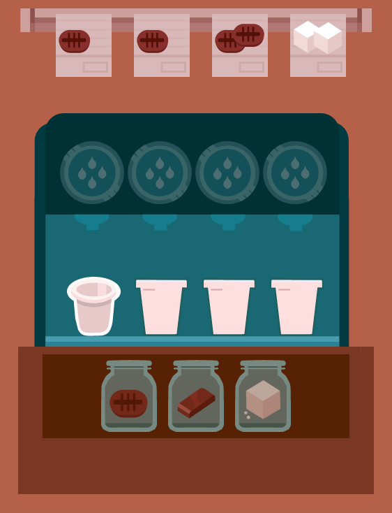

# React Trouble Brewing

This is a React Implementation of the great Brain Game "Trouble Brewing" by [lumosity](https://www.lumosity.com).
If you like this project, check out their highly innovative **cognitive training** apps [here](https://www.lumosity.com/en/brain-games/).

## Getting Started

This project is still in development. See Installing for development install.

### Prerequisites

- Modern IDE and Browser
- npm and nodejs

### Installing

1. Clone this repository
2. `npm install`
3. `npm start`

## Running the tests

tba

## Deployment

tba

## Built With

- [React](http://www.reactjs.org) - ReactJS
- [npm](https://www.npm.com) - Node Package Manager

## Contributing

Please read CONTRIBUTING.md for details on my code of conduct, and the process for submitting pull requests to me.
It will be available soon.

### Instructions

- Fork it (https://github.com/yourname/yourproject/fork)
- Create your feature branch (git checkout -b feature/fooBar)
- Commit your changes (git commit -am 'Add some fooBar')
- Push to the branch (git push origin feature/fooBar)
- Create a new Pull Request

## License

This project is licensed under the MIT License - see the [LICENSE.md](LICENSE.md) file for details

## Acknowledgments

- This project is purely private
- I created it in order to learn some CSS Tricks and State-Management via React
- I created it mainly for my kids, which are a huge fan of learning apps
- All graphics and logics are self-made
- If there is any trouble concerning the real "Trouble Brewing", don't hesitate to [contact me](https://github.com/devolt5)
